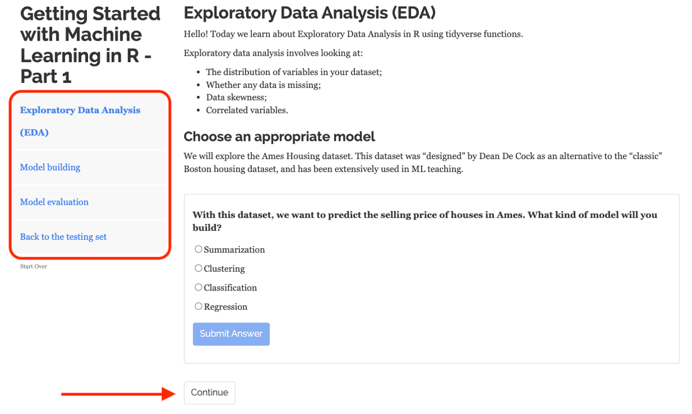

# Module3R

Learn Machine Learning in the browser or locally in your RStudio IDE with interactive tutorials!

## Installation

You can install the development version from [GitHub](https://github.com/) with:

``` r
# install.packages("remotes")
remotes::install_github("Sydney-Informatics-Hub/Module3R")
```

## How to run the tutorials

You can start any tutorial with:

``` r
learnr::run_tutorial("tutorial-of-choice", package = "Module3R")
```

For example:

``` r
learnr::run_tutorial("Part-1", package = "Module3R")
```

## List of available tutorials

| Tutorial | Description                                                               |
|:------------------|:----------------------------------------------------|
| `Part 1` | Ames housing dataset - Predict selling prices                             |
| `Part 2` | Pima Indian Women's diabetes dataset - Predict diabetes status            |
| `Part 3` | Unsupervised dimensionality reduction - Transforming groups of predictors |

## How to use the tutorials

These tutorials consist of content along with interactive components for checking and reinforcing understanding. Throughout the tutorials you will find:

-   Narrative, figures and illustrations;

-   Code exercises that you can edit and execute directly;

-   Quiz questions...

Each tutorial automatically preserve work done within them, so if you work on a few exercises or questions and then return to the tutorial later, you can pick up right where you have left off.

Each tutorial includes a Table of Contents and it reveals content one sub-section at a time:



Exercises are interactive R code chunks that allow you to directly execute R code and see its results. When a solution code chunk is provided, there will be a *Solution* button on the exercise that you can click if you are stuck:


### For the trainer

Introduction slides for the tutorials are [here](slides/Module3R.pptx). 
Instructions for adding new tutorials are [here](https://education.rstudio.com/blog/2020/09/delivering-learnr-tutorials-in-a-package/).

## Code of Conduct

Please note that this package is released with a [Code of Conduct](https://pages.github.sydney.edu.au/informatics/sih_codeofconduct/). By contributing to this package, you agree to abide by its terms.

### References

-   *Tierney, Nicholas J, and Dianne H Cook. 2018. "Expanding Tidy Data Principles to Facilitate Missing Data Exploration, Visualization and Assessment of Imputations." arXiv Preprint arXiv:1809.02264*;
-   *Adapted from "Linear Regression and tidymodels", available [here](https://www.gmudatamining.com/lesson-10-r-tutorial.html)*;
-   *Max Kuhn and Julia Silge, "Tidy Modeling with R", Version 1.0.0(2022-12-20)*;
-   *Adapted from "Decision Trees and Random Forests", available [here](https://www.gmudatamining.com/lesson-13-r-tutorial.html)*;
-   *Adapted from "Machine Learning with tidymodels" workshop, licensed CC Y-SA 4.0. Available [here](https://workshops.tidymodels.org/)*;
-   *Adapted from the learntidymodels package, available [here](https://github.com/tidymodels/learntidymodels)*.
