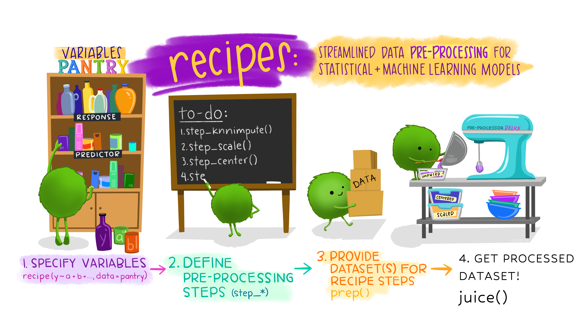

```{r setup, include=FALSE}
# load packages
library(learnr)
library(tidyverse)
library(naniar)
library(GGally)
library(ggcorrplot)
library(AmesHousing)
library(plotly)
library(bestNormalize)
library(janitor)
library(skimr)
library(here)
library(randomForest)
library(vip)
library(tidymodels)
library(parallel)
library(doParallel)
theme_set(theme_minimal())

# don't echo chunks
knitr::opts_chunk$set(echo = FALSE, warning = FALSE)

ameshousing <- AmesHousing::make_ames() %>%
  janitor::clean_names()

set.seed(123)

ames_split <- ameshousing %>%
    initial_split(prop = 0.8, 
                  strata = sale_price)

ames_train <- training(ames_split)
ames_test <- testing(ames_split)

ames_rec <-
  recipe(sale_price ~ ., data = ames_train) %>%
  step_best_normalize(sale_price) %>%
  step_filter(gr_liv_area <= 4000) %>%
  step_mutate(time_since_remodel = year_sold - year_remod_add, 
         house_age = year_sold - year_built) %>%
  step_select(-year_remod_add, -year_built) %>%
  step_nzv(all_predictors()) %>% 
  step_normalize(all_numeric_predictors()) %>% 
  step_dummy(all_nominal_predictors(), one_hot = FALSE) 

ames_lm <- linear_reg() %>% 
  set_engine("lm")

ames_wf <- workflow() %>%
  add_model(ames_lm) %>% 
  add_recipe(ames_rec)

ames_folds <- vfold_cv(ames_train, v = 10, repeats = 5)


all_cores <- parallel::detectCores(logical = TRUE)
cl <- makePSOCKcluster(all_cores)
registerDoParallel(cl)

ames_res <- ames_wf %>%
  fit_resamples(
    ames_folds,
    metrics = metric_set(rsq),
    control = control_resamples(save_pred = TRUE)
  )

ames_final <- ames_wf %>%
  last_fit(ames_split, 
           metrics = metric_set(rsq),
           control = control_last_fit(allow_par = TRUE))
```

## Welcome!

Predictive modeling, or supervised machine learning, is a powerful tool for using data to make predictions about the world around us. Once you understand the basic ideas of supervised machine learning, the next step is to practice your skills so you know how to apply these techniques wisely and appropriately.

In this tutorial, you will work through a case study using data from the real world; you will gain experience in exploratory data analysis, preparing data so it is ready for predictive modeling, training supervised machine learning models using **tidymodels**, and evaluating those models.

Tidymodels is a R package that helps you install and manage other packages that are used for modeling and machine learning in R. It provides a unified interface to a vast array of modeling and feature engineering approaches, and encourages good statistical practice via its design.

To follow this tutorial, you don't need to already have familiarity with tidymodels but you need some familiarity with **tidyverse** packages like *dplyr* and *ggplot2*, and exposure to machine learning basics.

**Now let's get started!**

## Exploratory Data Analysis (EDA)

Today we learn about Exploratory Data Analysis (EDA) in R using tidyverse functions.

Exploratory data analysis involves looking at:

-   The distribution of variables in your dataset;
-   Whether any data is missing;
-   Data skewness;
-   Correlated variables...
-   and much more! 

### Choose an appropriate model

We will explore the Ames Housing dataset. This dataset was "designed" by Dean De Cock as an alternative to the "classic" Boston housing dataset, and has been extensively used in ML teaching.

```{r model-type}
question(
  "With this dataset, we want to predict the selling price of houses in Ames. 
What kind of model will you build?",
  answer("Summarization"),
  answer("Clustering"),
  answer("Classification"),
  answer("Regression", correct = TRUE),
  allow_retry = TRUE,
  correct = "That's correct! To predict a continuous, numeric quantity like selling price, use regression models."
)
```

### Distribution, distribution, distribution

Start off this case study by examining your data set and visualizing the distribution of selling price.

#### Explore your dataset

**Instructions** Use the `skim()` function from the *skimr* package for an initial exploration of the Ames Housing dataset `ameshousing`:

-   What can you figure out about the different variables?
-   Which do you think are more or less important?

```{r skim, exercise=TRUE, exercise.lines = 2}
ameshousing %>%
  ____
```

**Checklist for predictors:**

-   Is it ethical to use this variable? (Or even legal?)
-   Will this variable be available at prediction time?
-   Does this variable contribute to explainability?

#### Explore your outcome variable

You need to do EDA on the outcome variable to:

-   identify outliers;
-   explore whether there is any skew in its distribution;
-   identify a transformation to use when modelling the data (if appropriate).

This is because many models, including ordinary linear regression, assume that prediction errors (and hence the response) are normally distributed.

**Instructions** Use the appropriate column from the data set in the call to `aes()` so you can plot a histogram of the selling price. Set the correct `x` and `y` labels. The *ggplot2* package, with functions like `ggplot()` and `geom_histogram()`, is included in the tidyverse.

```{r selling-price, exercise=TRUE, exercise.blanks = "___+"}
ameshousing %>% 
  ggplot(aes(x = ____)) + 
  geom_histogram(bins = 50) + #for each bin, the number of data points that fall into it are counted (frequency)
  labs(____ = "Sale Price",
       ____ = "Number of Houses sold")
```

*Normalization* is an example of a preprocessing step for modeling. The **bestNormalize** library can be used to identify the best normalising transformation. We can normalise the outcome variable as this both helps the distribution look more normal and helps keep our error metrics and final predictions easily interpretable. It also means that the errors of predicting the values of inexpensive and expensive houses will affect the prediction equally.

We will normalize the outcome variable using the **recipes** package, an extensible framework for pipeable sequences of feature engineering steps that provide preprocessing tools to be applied to data. The resulting processed output can be used as inputs for statistical or machine learning models.

**Instructions** Use the `recipe()` function to apply the following preprocessing steps:

-   use the `step_best_normalize()` function to transform the outcome variable (`sale_price`);

*The recipe shown below only has one preprocessing step (normalizing, that comes from an extra add-on package called bestNormalize), but you can implement many steps on one dataset during preprocessing*

```{r bestNormalize, exercise=TRUE, exercise.blanks = "___+"}
ames_recipe <- ____(sale_price ~ ., data = ameshousing) %>% # assigns columns to roles of “outcome” or “predictor” using the formula
  step_best_normalize(____)

ames_recipe

ames_recipe %>% prep() %>% tidy(number = 1) #to get the picked transformation

ames_recipe %>%
  prep() %>%
  juice() %>%
  ggplot(aes(x = sale_price)) + 
  geom_histogram(bins = 50) + #for each bin, the number of data points that fall into it are counted (frequency)
  labs(x = "Sale Price",
       y = "Number of Houses sold")
```

> The `prep()` function takes a recipe and computes everything so that the preprocessing steps can be executed. Note that this is done with the training data. All preprocessing and feature engineering steps use only the training data. Otherwise, information leakage can negatively impact the model's performance when used with new data.

> The `juice()` function is a nice little shortcut. When we `juice()` the recipe, we squeeze that training data back out, transformed in the ways we specified.

> A more detailed explanation on recipes is provided in *Part 3* of this Package.

{width="80%"}

### Analyse correlated variables

We can generate a correlation plot between all of our numeric variables. By default, the `cor()` method will calculate the Pearson correlation between the sale_price and the other variables. In this case, we use `pairwise.complete.obs`, which calculates the correlation between each pair of variables using all complete pairs of observations on those variables. We then plot the correlation using the **corrplot** library, which has several options for how to visualise a correlation plot.

**Instructions** Use the `cor()` function on the numerical variables from the `ameshousing` dataset and the `cor_pmat()` function to compute the p-values of correlation. Then, use `ggcorrplot()` to plot the correlation and correlation significance level.

```{r correlation, exercise=TRUE, exercise.blanks = "___+"}
# pull out all of the numerical variables
numVars <- ameshousing %>% 
  select_if(is.numeric) %>%
  names()

ameshousingCor <- ____(ameshousing[,numVars],
                      use = "pairwise.complete.obs")

ameshousingCor_pvalues <- cor_pmat(____)

____(ameshousingCor,
           type = "lower", 
           p.mat = ____) #add pvalues of the correlation
```

We can notice that `gr_liv_area` is the most correlated with `sale_price`, let's plot this relationship using the `ggplot()` function:

```{r corr-plot, exercise=TRUE, exercise.blanks = "___+"}
ameshousing %>%
  ggplot(aes(x = ____, y = ____)) + 
  geom_point(alpha = 0.1) + 
  labs(____ = "Sale Price/$1000",
       ____ = "Living Area (sq.ft)",
       title = "Ames Housing Data") +
  geom_smooth(method= "lm")
```

We can see that there are five houses with an area \> 4000 square feet that seem to be outliers in the data. We should filter them out, but we will do it later during the preprocessing steps.

## Model building

### Training and testing data

Training models based on all of your data at once is typically not a good choice 🚫. Instead, you can create subsets of your data that you use for different purposes, such as training your model and then testing your model.

Creating training/testing splits reduces overfitting. When you evaluate your model on data that it was not trained on, you get a better estimate of how it will perform on new data.

**Instructions**

-   Use the `initial_split()` function to create a data split that divides the original data into 80%/20% sections and (roughly) divides the data into subsets based on the target/outcome variable's distribution;
-   Use the functions `training()` and `testing()` to assign the 80% partition to `ames_train` and the 20% partition to `ames_test`, respectively.

```{r test-train, exercise=TRUE, exercise.blanks = "___+"}
# Split the data into training and test sets
set.seed(123) #so we all get the same results

ames_split <- ameshousing %>%
    ____(prop = 0.8,
         strata = ___)

ames_train <- training(___)
ames_test <- testing(___)

ames_train %>%
  glimpse()

ames_test %>%
  glimpse()
```

The code above takes an input data set and puts 80% of it into a training dataset and 20% of it into a testing dataset; it chooses the individual cases so that both sets are balanced in selling price.

*Stratified sampling would split within each quartile. This ensures that the training and testing sets have a similar distribution of the target variable, which can lead to more reliable model performance estimates.*

### Preprocessing steps for modeling

As we have already mentioned, in tidymodels, you can preprocess your data using **recipes**. Within a recipe, you can implement many steps on one dataset during preprocessing. There are an enormous number of different kinds of preprocessing you can do. For example, The year in which a house was built and the year when it was remodelled are not really the most relevant parameters we look at when buying a house: instead, buyers usually care a lot more about the age of the house and the time since the last remodel.

Some other preprocessing steps can include:

-   Scaling and centering numeric predictors;
-   Removing skewness from numeric variables;
-   One-hot and dummy variable encoding for categorical variables;
-   Removing correlated predictors and zero variance variables;
-   Imputing missing data.

**Instructions** Use the `recipe()` function to apply the following preprocessing steps:

-   filter out outliers (houses with a `gr_liv_area` \> 4000 square feet) using `step_filter()`;
-   create new variables called *"time_since_remodel"* and *"house_age"* using `step_mutate()`:

```{r preprocessing, exercise=TRUE, exercise.blanks = "___+"}
ames_rec <-
  ____(sale_price ~ ., data = ____) %>%
  step_best_normalize(sale_price) %>%
  step_filter(____ <= 4000) %>%
  step_mutate(____ = year_sold - year_remod_add, 
         ____ = year_sold - year_built) %>%
  step_select(-year_remod_add, -year_built) %>%
  step_nzv(all_predictors()) %>% # remove predictors that are highly sparse and unbalanced
  step_normalize(all_numeric_predictors()) %>% # normalize the data to a standard range by dividing each observation by the standard deviation of the feature
  step_dummy(all_nominal_predictors(), one_hot = FALSE) # create numeric representations of categorical data
ames_rec
  
ames_rec
```

### Build a model specification and create a modeling workflow

In tidymodels, you specify models using using the **parsnip** package and three concepts:

-   **type** differentiates models such as logistic regression (`log_reg()`), linear regression (`linear_reg`), random forest (`rand_forest()`) and so forth;
-   **mode** (`set_mode()`) includes common options like *regression* and *classification*, some model types support either of these while some only have one mode;
-   **engine** (`set_engine()`) is the computational tool which will be used to fit the model.

**Instructions** Build a linear regression model specification:

```{r model-build, exercise=TRUE, exercise.blanks = "___+"}
#Linear regression
ames_lm <- ____ %>% #set type
  set_engine("lm") #set engine
#set_mode("regression") we don't need this as the model linear_reg() only does regression
```

The **workflow** package was designed to capture the entire modeling process and combine *models* and *recipes* into a single object.

**Instructions** Create a workflow: start with `workflow()` to create an empty workflow and then add out model (`ames_lm`) and recipe (`ames_rec`) with `add_model()` and `add_recipe()` functions:

```{r wf, exercise=TRUE, exercise.blanks = "___+"}

#Add the recipe + model to a workflow
ames_wf <- workflow() %>%
  ____(ames_lm) %>% 
  ____(ames_rec)

ames_wf
```

## Model evaluation

### Resampling

If we only split the data once into a training and testing set, there is a risk that our model might be overfitting to the training data and perform poorly on new data. To overcome this, we can **resample** the training set to produce an estimate of how the model will perform. You can create these resampled data sets instead of using either your training set (which can give overly optimistic results, especially for powerful ML algorithms) or your testing set (which is extremely valuable and can only be used once or at most twice). One of these resampling methods is **cross-validation**, which involves splitting the data into multiple subsets, or "folds", and training and testing the model on each fold.

In **k-fold** cross-validation, we split the data into k equally sized folds. We then train the model on k-1 folds and test it on the remaining fold, repeating this process k times, so that each fold is used as the testing set once. We then average the performance of the model across all k folds to get an estimate of its generalization performance.

By using cross-validation, we can get a more accurate estimate of how well our model will perform on new, unseen data, and we can avoid overfitting to the training data.

```{r cross-validation}
question(
  "When you implement 10-fold cross-validation repeated 5 times, you:",
  answer("randomly divide your training data into 50 subsets and train on 49 at a time (assessing on the other subset), iterating through all 50 subsets for assessment"),
  answer("randomly divide your training data into 10 subsets and train on 9 at a time (assessing on the other subset), iterating through all 10 subsets for assessment. Then you repeat that process 5 times", correct = TRUE),
  answer("randomly divide your training data into 5 subsets and train on 4 at a time (assessing on the other subset), iterating through all 5 subsets. Then you repeat that process 10 times"),
  allow_retry = TRUE,
  correct = "Simulations and practical experience show that 10-fold cross-validation repeated 5 times is a great resampling approach for many situations. This approach involves randomly dividing your training data into 10 folds, or subsets or groups, and training on only 9 while using the other fold for assessment. You iterate through all 10 folds being used for assessment; this is one round of cross-validation. You can then repeat the whole process multiple, perhaps 5, times."
)
```

**Instructions** You can use tidymodels functions to create the kind of cross-validation folds appropriate for your use case. Here, try 10-fold cross-validation repeated 5 times.

-   The argument `v` specifies the number of folds for cross-validation;
-   The argument `repeats` specifies the number of repeats.

```{r folds, exercise=TRUE, exercise.blanks = "___+"}
set.seed(123)

ames_folds <- vfold_cv(ames_train, ___ = 10, ___ = 5)

ames_folds %>%
  glimpse()
```

Excellent job! You preprocessed this data, built a modeling workflow, and created cross-validation folds to evaluate model performance. 😎 Now it's time to put this all together and evaluate this model's performance.

### Train models

**Instructions** Use the function `fit_resamples()` to:

-   train and evaluate the model on each fold;
-   get the performance metrics for each fold;
-   get the average performance across all the folds.

```{r train, exercise=TRUE, exercise.blanks = "___+", exercise.timelimit = 800}
set.seed(123)

#Train the linear regression model
ames_res <- ames_wf %>%
  ____(
    ames_folds,
    metrics = metric_set(rsq),
    control = control_resamples(save_pred = TRUE)
  )

ames_res %>%
  glimpse()
```

The column `.metric` contains the performance statistics created from the 10 assessment sets. These can be manually unnested but the **tune** package contains a number of simple functions that can extract these data:

**Instructions** Use the function `collect_metrics()` to obtain the metrics we specified from the resampling results:

```{r metrics, exercise=TRUE, exercise.blanks = "___+"}
ames_res %>%
  ____
```

We can see that the regression relationship is very strong: \~90% of the variability in the selling price can be explained by the predictors.

If we wanted to try different model types for this data set, we could more confidently compare performance metrics computed using resampling to choose between models. Also, remember that at the end of our project, we return to our test set to estimate final model performance.

## Back to the testing set

We used resampling to evaluate model performance with the training set. Now, let's put this model to the test! 😎

Let's use the `last_fit()` function to fit to the entire training set one time and evaluate one time on the testing set, with everything we've learned during this case study. Our model has not yet seen the testing data, so this last step is the best way to estimate how well the model will perform when predicting with new data.

**Instructions**

-   Fit to the training set and evaluate on the testing set using `last_fit()`;
-   Obtain the performance metrics on the test set with `collect_metrics()`:

```{r test, exercise=TRUE, exercise.blanks = "___+", exercise.timelimit=800, warning=FALSE}
set.seed(123)

#Final fit on test dataset
ames_final <- ames_wf %>%
  ____(ames_split, 
       metrics = metric_set(rsq),
           control = control_last_fit(allow_par = TRUE))

# Obtain performance metrics on test data
ames_final %>%
  ____
```

The rsq metric is similar for both the training and testing datasets in our linear regression model. This is a good sign that the model is not over-fitting and can be used for making predictions on new data.

**Instructions** We can save the test set predictions by using the `collect_predictions()` function. This function returns a data frame which will have the response variables values from the test set and a column named `.pred` with the model predictions.

```{r final, exercise=TRUE, exercise.blanks = "___+"}
# Obtain test set predictions data frame
ames_final %>% ____
```

Wonderful! Sit back and run the given code to visualize the results!

```{r plot, exercise=TRUE}
ames_final %>% 
  collect_predictions() %>% 
  ggplot(aes(x = .pred, y = sale_price)) +
  geom_point(color = '#006EA1', alpha = 0.25) +
  geom_abline(intercept = 0, slope = 1, color = 'black', linewidth=0.5, linetype="dotted") +
  labs(title = 'Linear Regression Results - Ames Test Set',
       x = 'Predicted Selling Price',
       y = 'Actual Selling Price')
```
