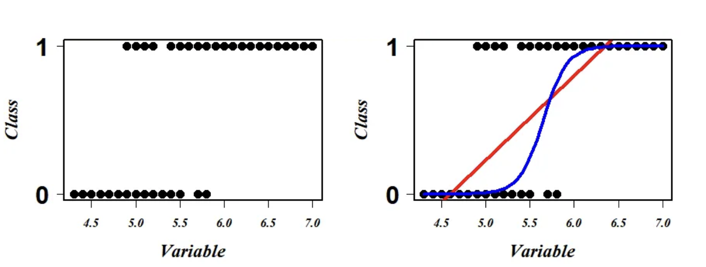

```{r setup, include=FALSE}
# load packages
library(learnr)
library(mlbench)
library(tidyverse)
library(GGally)
library(ggcorrplot)
library(bestNormalize)
library(skimr)
library(vip)
library(visdat)
library(tidymodels)
library(doParallel)
library(ranger)
library(glmnet)
theme_set(theme_minimal())

# don't echo chunks
knitr::opts_chunk$set(echo = FALSE, warning = FALSE)

set.seed(123)

# load the Pima Indians dataset from the mlbench dataset
data(PimaIndiansDiabetes)
diabetes_data <- PimaIndiansDiabetes

d_na <- diabetes_data %>%
  mutate(glucose = na_if(glucose, 0)) %>%
  mutate(triceps = na_if(triceps, 0)) %>%
  mutate(insulin = na_if(insulin, 0)) %>%
  mutate(mass = na_if(mass, 0)) %>%
  mutate(pressure = na_if(pressure, 0))

diabetes_split <- d_na %>%
    initial_split(prop = 0.7, 
                  strata = "diabetes")

d_na_train <- training(diabetes_split)
d_na_test <- testing(diabetes_split)

diabetes_rec <- recipe(diabetes ~ ., data = d_na_train) %>%
                step_impute_median(all_numeric_predictors()) %>%
                step_normalize(all_numeric_predictors())

diabetes_folds <- vfold_cv(d_na_train, v = 10, repeats = 5)

rf_model_diabetes <- 
  rand_forest(mtry = tune(),
              trees = tune(),
              min_n = tune()) %>%
  set_engine("ranger", importance = "impurity") %>% 
  set_mode("classification") 

rlr_model_diabetes <- 
  logistic_reg(mixture = tune(), 
               penalty = tune()) %>%
  set_engine("glmnet") %>%
  set_mode("classification")

rf_grid <- grid_random(mtry() %>% range_set(c(3, 6)),
                       trees(),
                       min_n(),
                       size = 10)

grid_ctrl <-
  control_grid(
    save_pred = TRUE,
    parallel_over = "everything",
    save_workflow = TRUE
)

all_cores <- parallel::detectCores(logical = TRUE)

cl <- makePSOCKcluster(all_cores)
registerDoParallel(cl)

rf_tune_model <- tune_grid(
  rf_model_diabetes, 
  diabetes_rec,       
  resamples = diabetes_folds,
  grid = rf_grid,
  control = grid_ctrl)

rlr_grid <- data.frame(mixture = seq(0, 1, 0.1),
                       penalty = seq(0, 1, 0.1))

rlr_tune_model <- tune_grid(
  rlr_model_diabetes,  
  diabetes_rec,       
  resamples = diabetes_folds, 
  grid = rlr_grid,
  control = grid_ctrl)

diabetes_wf_set <- workflow_set(list(diabetes_rec),  
             list(rf_model_diabetes, rlr_model_diabetes), 
             cross = TRUE) 

diabetes_wf_set <- diabetes_wf_set %>%
  option_add(grid=rf_grid, id="recipe_rand_forest") %>%
  option_add(grid=rlr_grid, id="recipe_logistic_reg")

diabetes_wf_set <- diabetes_wf_set %>%
                   workflow_map("tune_grid",
                   resamples = diabetes_folds,
                   control = grid_ctrl,
                   verbose = TRUE) 

best_results <- diabetes_wf_set %>%
  extract_workflow_set_result("recipe_logistic_reg") %>%
  select_best(metric="roc_auc")

final_diabetes_fit <- diabetes_wf_set %>%
  extract_workflow("recipe_logistic_reg") %>%
  finalize_workflow(best_results) %>%
  last_fit(diabetes_split)
```

## Exploratory Data Analysis (EDA)

Hello!

Today, we are working with the [Pima Indian Women's diabetes
dataset](https://en.wikipedia.org/wiki/Akimel_O%27odham) which contains
information on 768 Pima Indian women's diabetes status, as well as many
predictive features:

-   **pregnant** - Number of times pregnant;
-   **glucose** - Plasma glucose concentration at 2 hours in an [oral
    glucose tolerance
    test](https://en.wikipedia.org/wiki/Glucose_tolerance_test);
-   **pressure** - Diastolic blood pressure (mm Hg);
-   **triceps** - [Triceps skin fold thickness
    (mm)](https://en.wikipedia.org/wiki/Anthropometry_of_the_upper_arm) -
    a measure correlated with body fat;
-   **insulin** - 2-Hour serum insulin (mu U/ml);
-   **mass** - Body mass index (weight in kg/(height in m)\^2);
-   **age** - Age (years);
-   **diabetes** - diabetes status (pos - diabetic; neg - non-diabetic);
-   **pedigree** - diabetes pedigree function.

The diabetes pedigree function was developed by [Smith
1988](https://www.ncbi.nlm.nih.gov/pmc/articles/PMC2245318/) to provide
a synthesis of the diabetes mellitus history in relatives and the
genetic relationship of those relatives to the subject. It uses
information from parents, grandparents, siblings, aunts and uncles, and
first cousin to provide a measure of the expected genetic influence of
affected and unaffected relatives on the subject's eventual diabetes
risk.

The Pima Indians are a group of Native Americans living in an area
consisting of what is now central and southern Arizona. The short name,
"Pima" is believed to have come from a phrase meaning "I don't know,"
which they used repeatedly in their initial meetings with Spanish
colonists. Thanks Wikipedia!

### Choose an appropriate model

```{r model-type}
question(
  "With this dataset, we want to predict the diabetes status of Pima Indian women. 
What kind of model will you build?",
  answer("Summarization"),
  answer("Clustering"),
  answer("Classification", correct = TRUE),
  answer("Regression"),
  allow_retry = TRUE,
  correct = "That's correct! To predict group membership or discrete class labels, use classification models."
)
```

A classifier is some kind of rule / black box / widget that you can feed
a new example and it will spit out whether or not it is part of a given
class.

{height="50%"}

You can also have classifiers that categorise things into multiple (more
than two) categories e.g.

-   Which animal is this, out of the 12 animals I have trained my model
    on? 🐱
-   Do these test results indicate {none, stage 1, stage 2, stage 3,
    stage 4} cancer? 🚑
-   Is this email important, not important but not spam, or spam? 📧

### Analyse Missing data

Start off this case study by examining your data set and analyse any
missing values.

**Instructions** Use the `summary()` function from the *skimr* package
for an initial exploration of the Pima Indians dataset `diabetes_data`.

```{r summary, exercise=TRUE, error=TRUE, exercise.lines = 2}
diabetes_data %>%
  ____
```

Within this dataset, it is clear that the values of several variables
are zero when it is impossible for them to be so (i.e. this value could
not be zero if it was measured). Hence, we are dealing with *"hidden"
missing data*.

```{r missingness_A}
question(
  "Which are the variables that have zero “values” that are actually likely to be missing:",
  answer("pregnant"),
  answer("glucose", correct = TRUE),
  answer("pressure", correct = TRUE),
  answer("triceps", correct = TRUE),
  answer("insulin", correct = TRUE),
  answer("mass", correct = TRUE),
  answer("pedigree"),
  answer("age"),
  answer("diabetes"),
  allow_retry = TRUE,
  correct = "That's correct!"
)
```

```{r missingness_B}
question(
  "To handle this, what should be done with these zero values? ",
  answer("Leave them as zero values"),
  answer("Recode them as NA to indicate missingness", correct = TRUE),
  answer("Remove the rows containing zero values"),
  allow_retry = TRUE,
  correct = "That's correct! Recoding zero values as NA is a common approach to handle hidden missing data in a dataset. This allows for appropriate treatment and analysis of the missing values. Leaving them as zero values might incorrectly imply that the measurements were taken and resulted in a zero value. Removing the rows can lead to the loss of valuable information."
)
```

Let's create a new dataframe `d_na`, which has the missing values
recoded as `NA` and visualise it.

**Instructions**

-   Use the `vis_miss()` function to visualise the missing values of the
    `diabetes_data` object;
-   Use the `mutate()` function from the **dplyr** package to create a
    new dataframe called `d_na` and recode all the 0 values of the
    variables `glucose`, `triceps`, `insulin`, `mass` and `pressure` to
    NAs;
-   Use the `vis_miss()` function to visualise the variables of the new
    `d_na` dataframe.

```{r vis, exercise=TRUE}
vis_miss(____)

d_na <- diabetes_data %>%
  ____(glucose = na_if(glucose, 0)) %>%
  mutate(____ = na_if(triceps, 0)) %>%
  mutate(insulin = na_if(____, 0)) %>%
  mutate(mass = ____(mass, 0)) %>%
  mutate(pressure = na_if(pressure, ____))

____(d_na)
```

## Our data budget and preprocessing steps

### Training and testing data

Training models based on all of your data at once is typically not a
good choice 🚫. Instead, you can create subsets of your data that you
use for different purposes, such as training your model and then testing
your model.

Creating training/testing splits reduces overfitting. When you evaluate
your model on data that it was not trained on, you get a better estimate
of how it will perform on new data.

**Instructions**

-   Use the `initial_split()` function to create a data split that
    divides the original data into 70%/30% sections and (roughly)
    divides the data into subsets based on the target/outcome variable's
    distribution (`diabetes`);
-   Use the functions `training()` and `testing()` to assign the 70%
    partition to `d_na_train` and the 30% partition to `d_na_test`,
    respectively.

```{r test-train, exercise=TRUE, error=TRUE, exercise.blanks = "___+"}
# Split the data into training and test sets
set.seed(123) #so we all get the same results

diabetes_split <- d_na %>%
    initial_split(prop = ____, 
                  strata = ___)

d_na_train <- training(___)
d_na_test <- testing(___)

glimpse(d_na_train)
glimpse(d_na_test)
```

The code above takes an input data set and puts 70% of it into a
training dataset and 30% of it into a testing dataset; it chooses the
individual cases so that both sets are balanced in the `diabetes`
variable.

*Stratified sampling would split within each quartile. This ensures that
the training and testing sets have a similar distribution of the target
variable, which can lead to more reliable model performance estimates.*

Let's do some standard checks on the train/test split!

**Instructions**

-   Use the `dim()` function to look how many samples we have in the
    training (`d_na_train`) and testing (`d_na_test`) sets;
-   Use `bind_rows()` to bind together the rows of the training and
    testing sets;
-   Use `ggplot()` to plot a histogram of the output (`diabetes`) to
    check we stratified appropriately.

```{r strata, exercise=TRUE, error=TRUE, exercise.blanks = "___+"}
# check how many samples we have in training
____(d_na_train)

# check how many samples we have in testing
____(d_na_test)

# bind together the rows of the training and testing sets
together <- bind_rows(train = ___,
                      test = ____,
                      .id = "test_train" ) 

# plot a histogram of the output to check we stratified appropriately
together %>%
  ggplot(aes(x = ____))+
  geom_bar()+
  facet_grid(test_train~., scales = "free")
```

### Preprocessing step for modeling

In tidymodels, you can preprocess your data using **recipes**. Within a
recipe, you can implement many steps on one dataset during
preprocessing. There are an enormous number of different kinds of
preprocessing you can do. For example, you can impute missing data.
*Imputation* is often used to handle missing data because many
statistical methods and machine learning algorithms require complete
data. When we do imputation, we aren't adding new information to our
dataset, but we are using the patterns in our dataset so that we don't
have to throw away the data that have some variables missing.

**Instructions**

-   Use the `recipe()` function to apply the following preprocessing
    steps;
-   use the `step_impute_median()` function to perform median imputation
    on all predictors;
-   normalize the data to a standard range by dividing each observation
    by the standard deviation of the feature using `step_normalize()`.

```{r preprocessing, exercise=TRUE, error=TRUE, exercise.blanks = "___+"}
set.seed(123)

diabetes_rec <- ____(diabetes ~ ., data = d_na_train) %>%
                ____(all_numeric_predictors()) %>% # perform median imputation
                ____(all_numeric_predictors()) # all our predictors are numeric so standardize them
  
diabetes_rec  
```

### Resampling

At some point we're going to want to do some *parameter tuning*
(explained later), and to do that we're going to want to use
**cross-validation**. We can create a cross-validated version of the
training set in preparation for that moment:

**Instructions** You can use tidymodels functions to create the kind of
cross-validation folds appropriate for your use case. Here, try 10-fold
cross-validation repeated 5 times.

-   The argument `v` specifies the number of folds for cross-validation;
-   The argument `repeats` specifies the number of repeats.

```{r folds, exercise=TRUE, error=TRUE, exercise.blanks = "___+"}
set.seed(123)

diabetes_folds <- vfold_cv(d_na_train, ___ = 10, ___ = 5)

glimpse(diabetes_folds)
```

## Model building and tuning hyperparameters

Some model parameters cannot be learned directly from a dataset during
model training; these kinds of parameters are called
**hyperparameters**. Some examples of hyperparameters include the number
of randomly selected variables to be considered at each split in a
tree-based model (called `mtry` in tidymodels).

Instead of learning these kinds of hyperparameters during model
training, we can estimate the best values for these parameters by
training many models on a resampled data set (like the cross-validation
folds we have previously created) and measuring how well all these
models perform. This process is called **tuning**.

```{r tuning-type}
question("Are these tuning hyperparameters?",
  answer("The random seed"),
  answer("Regularization strength in a linear regression model", correct = TRUE),
  answer("Threshold for minimum number of samples required to split an internal node in a decision tree", correct = TRUE),
  allow_retry = TRUE,
  correct = "That's correct! There are parameters that directly affect the performance of a machine learning model during the training process.")
```

You can identify which parameters to `tune()` in a model specification.

### Tree-based models

A tree-based model is a type of algorithm that creates a tree-like
structure to make predictions about a certain outcome, such as whether a
customer will buy a product or not. The tree structure consists of nodes
that represent different features, and the algorithm uses these features
to split the data into smaller and smaller subsets. Each subset is then
assigned a label based on the majority of its observations, and this
process continues until the algorithm reaches a stopping criterion or
has created a fully-grown tree. Once the tree is created, it can be used
to make predictions by following the path through the tree that
corresponds to a given set of input features. Tree-based models are
simple and intuitive to understand, and can be used for both
classification and regression tasks.

-   A **Decision Tree** is a simple type of tree-based model that use a
    hierarchical structure of nodes to make predictions about a certain
    outcome. The process continues until a stopping criterion is met,
    such as a maximum tree depth or a minimum number of observations per
    leaf node, and it can predict the outcome. A single decision tree
    may not be accurate enough for many real-world problems;

{width="80%"}

-   A **Random Forest** model builds many *decision trees*, each using a
    randomly selected subset of the data and features, and then
    combining their predictions to make a final prediction.

We can specify a random forest classifier with the following
hyperparameters:

-   **mtry**: the number of predictors that will be randomly sampled at
    each split when creating the tree models;
-   **trees**: the number of decision trees to fit and ultimately
    average;
-   **min_n**: The minimum number of data points in a node that are
    required for the node to be split further.

### Logistic regression

Logistic regression is a type of regression where the range of mapping
is confined to [0,1], unlike simple linear regression models where the
domain and range could take any real value. Logistic regression is a
type of algorithm that is used to predict a binary outcome, such as
whether a patient is likely to develop diabetes or no. It works by
creating a mathematical function that predicts the probability of an
observation belonging to a certain class (e.g., diabetes or not
diabetes). The function takes into account one or more input variables,
such as the patients's age, gender, or body mass index. The output of
the function is a value between 0 and 1, which represents the
probability of the observation belonging to the positive class (e.g.,
developing diabetes). To make a prediction, the algorithm compares the
predicted probability to a threshold value (e.g., 0.5), and assigns the
observation to the positive class if the probability is greater than the
threshold, and to the negative class otherwise. The scatter plot of this
data looks something like this:

{width="80%"}

We see that the data points are in the two extreme clusters. For our
prediction modeling, a naive regression line in this scenario will give
a nonsense fit (red line on the right plot) and what we actually require
to fit is a line (blue on the right plot) to explain (or to correctly
separate) a maximum number of data points. Logistic regression is a
scheme to search this most optimum blue line.

**Regularization** is a technique that can be used to prevent
overfitting of the model. A *regularized logistic regression model*, is
a logistic classifier that has been modified to include a regularization
term. This is done by adding a **penalty** to the model that discourages
it from giving too much importance to any variable.

There are several regularized regression models, defined with the
mixture parameter:

-   **Ridge** regularization encourages the model to have small
    coefficient values (`mixture = 0`);
-   **Lasso** regularization encourages the model to set some of the
    coefficients to zero, which performs feature selection. This can
    help improve the model's interpretability and reduce the impact of
    irrelevant features on the model's performance (`mixture = 1`);
-   **Elastic Net** regularization combines Ridge and Lasso
    regularization by adding a penalty term that is a weighted average
    of both penalties. This approach can provide the benefits of both
    Ridge and Lasso regularization, such as feature selection and
    coefficient shrinkage (`mixture between 0 and 1`).

To specify a random forest model with tidymodels, we need the
`rand_forest()` function. The hyperparameters of the model are arguments
within the `rand_forest()` function and may be set to specific values.
However, if tuning is required, then each of these parameters must be
set to `tune()`.

We will be using the *ranger* engine. This engine has an optional
importance argument which can be used to track *variable importance*
measures. In order to make a variable importance plot with `vip()`, we
must add `importance = 'impurity'` inside our `set_engine()` function:

**Instructions**

-   use `rand_forest()` to specify a random forest model and that the
    `mtry`, `trees` and `min_n` hyperparameters need to be tuned;
-   specify a logistic regression model with the `logistic_reg()`
    function and that the `mixture` and `penalty` hyperparameters need
    to be tuned.

```{r models, exercise=TRUE, error=TRUE, exercise.blanks = "___+"}
# random forest

rf_model_diabetes <- 
  rand_forest(mtry = tune(),
              ____ = tune(),
              min_n = ____) %>%
  # select the engine/package that underlies the model
  set_engine("ranger", importance = "impurity") %>% #get variable importance scores
  # choose either the continuous regression or binary classification mode
  set_mode("classification") 

# logistic regression

rlr_model_diabetes <- 
  ____(____ = ____, 
       ____ = ____) %>%
  set_engine("glmnet") %>%
  set_mode("classification")
```

> **Note** Nothing about this model specification is specific to the
> diabetes dataset.

### Find which parameters will give the model its best accuracy

During hyperparameters tuning we are going to:

-   Try different values and measure their performance;
-   Find good values for these parameters;
-   Once the value(s) of the parameter(s) are determined, a model can be
    finalized by fitting the model to the entire training set.

#### `grid_random()`

You have a couple of options for how to choose which possible values for
the tuning parameters to try. One of these options is creating a random
grid of values. **Random grid search** is implemented with the
`grid_random()` function in tidymodels, taking a *sequence of
hyperparameter names to create the grid*. It also has a `size` parameter
that specifies the number of random combinations to create.

**Instructions**

-   Use the `grid_random()` function to create a random grid of values
    for the hyperparameters `mtry()`, `trees()` and `min_n()`;

The `mtry()` hyperparameter requires a pre-set range of values to test
since it cannot exceed the number of columns in our data. When we add
this to `grid_random()` we can pass `mtry()` into the `range_set()`
function and set a range for the hyperparameter with a numeric vector.

-   In the code below, set the range from 3 to 6. This is because we
    have 9 columns in `d_na` and we would like to test `mtry()` values
    somewhere in the middle between 1 and 9, trying to avoid values
    close to the ends;

-   You can then use the function `tune_grid()` to tune either a
    workflow or a model specification with a set of resampled data, such
    as the cross-validation we created. Grid search, combined with
    resampling, requires fitting a lot of models! These models don't
    depend on one another and can be run in parallel.

```{r tuning, exercise=TRUE, error=TRUE, exercise.blanks = "___+", exercise.timelimit = 1000}
set.seed(123)

#create a random grid of values for the hyperparameters mtry(), trees() and min_n()
rf_grid <- ____(mtry() %>% range_set(c(____, ____)),
                       trees(),
                       min_n(),
                       size = ____)

#View grid
rf_grid

#Tune random forest model 
rf_tune_model <- ____(
  rf_model_diabetes,  #your model
  diabetes_rec,       #your recipe
  resamples = diabetes_folds, #your resampling
  grid = ____, #your gird
  control = grid_ctrl)

rf_tune_model
```

Great job! Let's now use `collect_metrics()` and `show_best()` functions
to:

-   extract the metrics calculated from the cross-validation performance
    across the different values of the parameters;
-   to see which model performed the best, in terms of the **"roc_auc"**
    metric.

```{r besttuning, exercise=TRUE, error=TRUE, exercise.blanks = "___+"}
# extract all metrics from the cross-validation performance
rf_tune_model %>%
  ____()

# see which model performed the best
rf_tune_model %>%
  ____(metric = "roc_auc")
```

#### `data.frame()`

We can also specify the values of the parameters to tune with a tuning
grid, entered as a **data frame**. It contains all the combinations of
parameters to be tested.

**Instructions** Use the `data.frame()` function to create a tuning grid
for the `mixture` and `penalty` hyperparameters, to use later for tuning
our regularized logistic regression model:

```{r dftuning, exercise=TRUE, error=TRUE, exercise.blanks = "___+"}
rlr_grid <- ____(mixture = seq(0, 1, 0.1),
                       penalty = seq(0, 1, 0.1))
rlr_grid
```

Well done! You just created a data frame named "rlr_grid" with two
columns: *"mixture"* and *"penalty"*. You did this by using the `seq()`
function with the parameters `0`, `1`, and `0.1`. This will create a
sequence of numbers starting from 0, incrementing by 0.1, and ending
at 1. The resulting data frame `rlr_grid` has 11 rows, corresponding to
the 11 values in the "mixture" and "penalty" sequences.

Let's use `tune_grid()` again for hyperparameters tuning of the
`rlr_model_diabetes` logistic regression model, doing cross validation
for each row of the `rlr_grid` tuning grid. Let's then use the
`collect_metrics()` and `show_best()` functions to visualise our best
tuning results for the **"roc_auc"** metric:

```{r lrtuning, exercise=TRUE, error=TRUE, exercise.blanks = "___+"}
set.seed(123)

# hyperparameters tuning
rlr_tune_model <- tune_grid(
  ____,  #your model
  diabetes_rec, #your recipe 
  resamples = diabetes_folds, #your resampling 
  grid = ____, #your grid
  control = grid_ctrl)

# collect all metrics
rlr_tune_model %>%
  ____

# show the best "roc_auc" results
rlr_tune_model %>%
  show_best(____)
```

## Compare models and preprocessing steps

Tidymodels allows us to perform all of the above steps in a much faster
way with the **workflowsets** package.

**Instructions** - Use the `workflow_set()` function to combine your
`rlr_model_diabetes` and `rf_model_diabetes` models with your
`diabetes_rec` recipe:

```{r workflowset, exercise=TRUE, error=TRUE, exercise.blanks = "___+"}
diabetes_wf_set <- ____(list(diabetes_rec),  #list of recipes
             list(rf_model_diabetes, ____), #list of models
             cross = TRUE) #all combinations of the preprocessors and models are used to create the workflows

# print the workflow id
diabetes_wf_set$wflow_id

# print the options for each id
diabetes_wf_set$option
```

Great! You have now combined your recipe and models within the
`diabetes_wf_set` object. The workflow ids created have been
automatically named *recipe_rand_forest* and *recipe_logistic_reg*. If
we have a look at the options, there are no grids specified for our
workflows.

Let's add our `rf_grid` and `rlr_grid` girds with the `option_add()`
function:

```{r workflowset_grid, exercise=TRUE, error=TRUE, exercise.blanks = "___+"}
diabetes_wf_set <- diabetes_wf_set %>%
  option_add(grid=rf_grid, id="recipe_rand_forest") %>% #add the rf_grid
  ____(grid=____, id="recipe_logistic_reg")       #add the rlr_grid

diabetes_wf_set$option
```

We can now call `tune_grid()`. Note that the workflow set object
`diabetes_wf_set` already includes your recipe, your models and your
grids, so you will only need to add your resampling object to the
`workflow_map()` function.

> The first argument in the `workflow_map()` function is a function name
> from the **tune** package (`tune_grid()`, `fit_resamples()`..)

```{r workflowmap, exercise=TRUE, error=TRUE, exercise.blanks = "___+", exercise.timelimit = 1000}
set.seed(123)

diabetes_wf_set <- diabetes_wf_set %>%
                   ____("tune_grid",
                   resamples = ____, 
                   control = grid_ctrl,
                   verbose = TRUE) 
diabetes_wf_set
```

The `results` column contains the results of each call to `tune_grid()`
for the workflows. From these results, we can get quick assessments of
how well these models classified the data using the `rank_results()` and
`autoplot()` functions.

**Instructions** Call the `rank_results()` and `autoplot()` functions on
your tuned workflows. You specifically want to have a look at the
`"roc_auc"` metric:

```{r autoplot, exercise=TRUE, error=TRUE, exercise.blanks = "___+"}
#to get the rankings of the models (and their tuning parameter sub-models) as a data frame:
rank_results(diabetes_wf_set, rank_metric = ____)

#to plot the results
autoplot(____, metric = "roc_auc")
```

## Extract best tuning results

The plot above shows the results for all tuning parameter combinations
for each model. We can use the `extract_workflow_set_result()` and
`select_best()` functions to extract the best tuning results.

**Instructions**

-   Extract the tuning results for the `"recipe_logistic_reg"` workflow;
-   Select the best results for the `**roc_auc**` metric.

```{r best, exercise=TRUE, error=TRUE, exercise.blanks = "___+"}
best_results <- diabetes_wf_set %>%
  extract_workflow_set_result(____) %>%
  ____(metric="roc_auc")

best_results
```

## Update and fit the workflow

The last step in hyperparameter tuning is to use `finalize_workflow()`
to add our optimal model to our workflow object, and apply the
`last_fit()` function to our workflow and our train/test split object.
This will automatically train the model specified by the workflow using
the training data, and produce evaluations based on the test set.

**Instructions**

-   Use the `extract_workflow()` function to extract the specifications
    of your best workflow (`recipe_logistic_reg`);
-   Update your workflow with your optimal model (`best_results`) using
    the `finalize_workflow()` function;
-   Fit to the training set and evaluate on the testing set using
    `last_fit()`.

```{r update, exercise=TRUE, error=TRUE, exercise.blanks = "___+", exercise.timelimit=1000}
set.seed(123)

final_diabetes_fit <- diabetes_wf_set %>%
  ____("recipe_logistic_reg") %>%
  finalize_workflow(____) %>%
  ____(diabetes_split)

final_diabetes_fit

final_diabetes_fit %>% collect_metrics()
```

> Since we supplied the train/test object when we fit the workflow, the
> metrics are evaluated on the test set. Now when we use the
> `collect_metrics()` function (the same we used when tuning our
> parameters) to extract the performance of the final model (since
> `final_diabetes_fit` now consists of a single final model) applied to
> the test set.

### AUC: Area under the curve and Confusion Matrix

A good classifier will have high precision and high specificity,
minimizing both false positives and false negatives. In practice, and
with an imperfect classifier, you can tune a knob to say which of those
two you care more about. There will be some kind of a trade-off between
the two.

To capture this balance, we often use a **Reciever Operator
Characteristic (ROC) curve** that plots the *false positive* rate along
the x-axis and the *true positive* rate along the y-axis, for all
possible trade-offs. A line that is diagonal from the lower left corner
to the upper right corner represents a random guess at labelling each
example. The higher the line is in the upper left-hand corner, the
better the classifier in general. AUC computes the area under this
curve. For a perfect classifier, AUC = 1, for a random guess, AUC=0.5.
Objective: maximize.

{width="80%"}

A **confusion matrix** is a matrix that compares "the truth" to the
labels generated by your classifier. When we label a cat correctly, we
refer to this as a *true positive*. When we fail to label a cat as a
cat, this is called a *false negative*. However, if we label something
which is not a cat as a cat, this is called a *false positive*; and if
we correctly label something which is not a cat, as not a cat, then this
is a *true negative*. In our case, the confusion matrix will look like
this:

-   true positive **(TP)**: Diabetic correctly identified as diabetic
-   true negative **(TN)**: Healthy correctly identified as healthy
-   false positive **(FP)**: Healthy incorrectly identified as diabetic
-   false negative **(FN)**: Diabetic incorrectly identified as healthy

{width="80%"}

We can plot the ROC curve to visualize test set performance of our
model, and generate a confusion matrix.

*Note In R, factor levels are ordered alphabetically by default, which
means that "no" comes first before "yes" and is considered the level of
interest or positive case. Use the argument `event_level = "second"` to
alter this as needed.*

**Instructions**

-   Extract the prediction values from your final fit object with
    `collect_predictions()`;
-   Plot a ROC curve with the `roc_curve()` function;
-   Plot a confusion matrix with the `conf_mat()` function.

```{r roc, exercise=TRUE, error=TRUE, exercise.blanks = "___+"}
#ROC curve
  ____(final_diabetes_fit) %>% #extract the prediction values from your final fit object
  ____(diabetes, event_level="second", .pred_pos) %>%  #specify which level of truth to consider as the "event"
                autoplot()

#confusion matrix dataframe
conf_matrix_rf <- final_diabetes_fit %>%
  collect_predictions() %>%
  ____(truth = diabetes, estimate = .pred_class) 

conf_matrix_rf

#confusion matrix plot
conf_matrix_rf %>%
  autoplot()
```

## Variable importance

In order to visualize the variable importance scores of our model, we
will need to:

-   manually train our workflow object with the `fit()` function on the
    training data;
-   extract the trained model with the `pull_workflow_fit()` function;
-   pass the trained model to the `vip()` function.

```{r vip, exercise=TRUE, error=TRUE, exercise.blanks = "___+", exercise.timelimit=1000}
set.seed(123)

#extract the final workflow
final_workflow <- diabetes_wf_set %>%
  extract_workflow("recipe_logistic_reg") %>%
  finalize_workflow(best_results)

#fit on the training data
wf_fit <- final_workflow %>%
  ____(data = d_na_train)

#extract the trained model
wf_fit <- wf_fit %>% 
          ____()

#plot variable importance
____(wf_fit)
```

This returns a ggplot object with the variable importance scores from
our model.

We see from the results below, that the glucose concentration, body mass
index and age are the most important predictors of diabetes.

Often you will need to consider a large number of possible modeling
approaches for a task at hand, especially for new data sets and/or when
there is little knowledge about what modeling strategy will work best.
Today you have practived how to use workflow sets to investigate
multiple models or feature engineering strategies in such a situation.

Well done `r emojifont::emoji('star')`!
