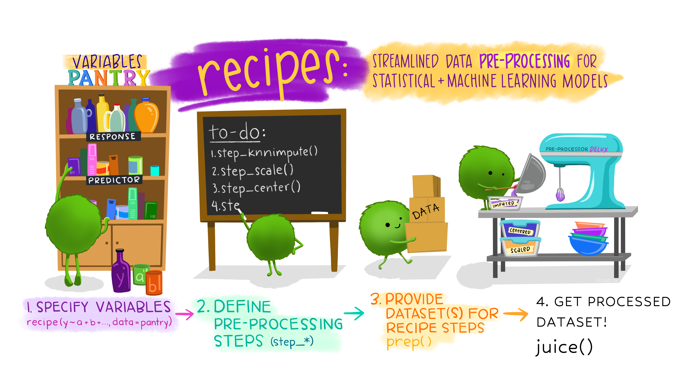

```{r setup, include=FALSE}
library(learnr)
library(tidyverse)
library(tidymodels)
library(embed)
library(tidytext)
library(sortable)
library(ggcorrplot)
library(doParallel)
library(emojifont)
library(finetune)
library(tune)
library(glmnet)
library(ranger)
source("plot_top_loadings.R")
source("get_loading_data.R")
theme_set(theme_minimal())

knitr::opts_chunk$set(echo = FALSE)

set.seed(123)

zoo_names <- c("animal_name", "hair", "feathers", "eggs", "milk", "airborne", "aquatic", "predator", "toothed", "backbone", "breathes", "venomous", "fins", "legs", "tail", "domestic", "catsize", "class")
anim_types <- tribble(~class, ~type,
                      1, "mammal",
                      2, "bird",
                      3, "reptile",
                      4, "fish",
                      5, "amphibian",
                      6, "insect",
                      7, "other_arthropods")
zoo <- 
  read_csv("http://archive.ics.uci.edu/ml/machine-learning-databases/zoo/zoo.data", 
           col_names = zoo_names) %>%
  left_join(anim_types) %>%
  select(-class) %>%
  rename(animal_type=type) 
  
zoo$animal_name <- as.factor(zoo$animal_name)
zoo$animal_type <- as.factor(zoo$animal_type)

### correlation ###
numVars <- zoo %>% 
  select_if(is.numeric) %>%
  names()

zooCor <- cor(zoo[,numVars],
                      use = "pairwise.complete.obs")

zooCor_pvalues <- cor_pmat(zooCor)

### PCA ####

zoo_split <- zoo %>%
    initial_split(prop = 0.8)

zoo_train <- training(zoo_split)
zoo_test <- testing(zoo_split)
zoo_folds <- vfold_cv(zoo_train, v = 10, repeats = 5)

grid_ctrl <-
  control_grid(
    save_pred = TRUE,
    parallel_over = "everything",
    save_workflow = TRUE
)

all_cores <- parallel::detectCores(logical = TRUE)

cl <- makePSOCKcluster(all_cores)
registerDoParallel(cl)

pca_rec <- recipe(data = zoo_train, formula = ~ .) %>%
  update_role(animal_name, animal_type, new_role = "id") %>%
  step_scale(all_predictors()) %>%
  step_center(all_predictors()) %>%
  step_pca(all_predictors(), id = "pca")

pca_prep <- prep(pca_rec)
pca_loading <- tidy(pca_prep, id="pca")
pca_variances <- tidy(pca_prep, id = "pca", type = "variance")

pca_bake <- bake(pca_prep, zoo)

zoo_rec <- recipe(data = zoo_train, formula = ~.) %>%
  update_role(animal_name, animal_type, new_role = "id") %>%
  step_normalize(all_predictors()) %>%
  step_pca(all_predictors())

zoo_prep <- prep(pca_rec)
zoo_bake <- pca_bake
zoo_juice <- juice(zoo_prep)

### Modeling ###

multi_model_zoo <- multinom_reg(
  mode = "classification",
  engine = "glmnet",
  penalty = tune(),
  mixture = tune()
)

rf_spec <- rand_forest(trees = 1000) %>%
  set_mode("classification") %>%
  set_engine("ranger")

base_rec <- recipe(animal_type ~ ., data = zoo_train) %>% 
  step_normalize(all_numeric_predictors()) %>%
  step_dummy(all_nominal_predictors(), one_hot = FALSE) 

rec_pca <- recipe(animal_type ~ ., data = zoo_train) %>% 
  step_normalize(all_numeric_predictors()) %>%
  step_dummy(all_nominal_predictors(), one_hot = FALSE) %>%
  step_pca(all_numeric_predictors(), num_comp = tune())

zoo_wf_set <- workflow_set(list(basic = base_rec, pca = rec_pca),  
             list(multi = multi_model_zoo, rf = rf_spec), 
             cross = TRUE) 

zoo_wf_set_tuning <- zoo_wf_set %>%
                   workflow_map("tune_grid",
                   resamples = zoo_folds,
                   control = grid_ctrl, 
                   grid = 10, 
                   metrics = metric_set(roc_auc),
                   verbose = TRUE)

zoo_res <- 
  zoo_wf_set_tuning %>% 
  extract_workflow("basic_multi") %>% 
  finalize_workflow(
    zoo_wf_set_tuning %>% 
      extract_workflow_set_result("basic_multi") %>% 
      tune::select_best(metric = "roc_auc") 
  ) %>% 
  last_fit(split = zoo_split, 
           metrics = metric_set(roc_auc),
           control = control_last_fit(allow_par = TRUE))
```

## Unsupervised dimensionality reduction

Dimension reduction is a regularly used unsupervised method in exploratory data analysis and predictive models.

This tutorial focuses on *transforming whole groups of predictors together* using **Linear dimensionality reduction** with [Principal component analysis (PCA)](https://en.wikipedia.org/wiki/Principal_component_analysis).

This methods can also be used for [feature extraction](https://en.wikipedia.org/wiki/Feature_extraction) prior to modeling.

While we're applying this method we will getter a better understanding on topics we have already discussed in **Part 1** and **Part 2** of this module like:

-   How to create a `recipe`
-   How to update a `role`
-   How to add `steps`
-   How to `prep`
-   How to `bake` or `juice`
-   A modeling workflow

## Exploratory Data Analysis

Before beginning any dimensionality reduction, we can spend some time investigating our data.
We will use the `zoo` dataset to explore these methods.
`zoo` contains observations collected on `r nrow(zoo)` zoo animals.

**Instructions** To see the first ten rows of the data set click on **Run Code**.\
You can use the black triangle that appears at the top right of the table to scroll through all of the columns in `zoo`.

```{r intro-zoo, exercise=TRUE}
zoo
```

Alternatively, use the `glimpse()` function to see columns in a more compact way.
You can click on the **Solution** button to get help.

```{r glimpse-zoo, exercise=TRUE, warning=FALSE, message=FALSE, error=FALSE}
glimpse(___)
```

We can see that `zoo` has `r nrow(zoo)` rows and `r ncol(zoo)` columns, two of them (`animal_name` and `animal_type`) are characters.
Let's count the number animals for each `animal_type`.

```{r cnt-type, exercise=TRUE}
zoo %>% 
  count(___)
```

While looking at the numbers helps, plotting is always a good idea to get an overall view of the data, especially if many sub-categories are present.

**Instructions** Plot the number of animals in each `animal_type` category.
Fill in the blanks and click on **Run Code** to generate the plot.

```{r type-bar, exercise=TRUE}
zoo %>%
  ggplot(aes(___)) +
  geom_bar(fill="#CA225E") +
  theme_minimal()
```

We can also look at the distribution of animals that lay `eggs` across `animal_type`.
*Note*: The `eggs` column is coded in `0` and `1` for animals that `"doesn't lay eggs"` and `"lay eggs"` respectively.
Let's do some data wrangling with the `recode()` function to plot it neatly.

```{r type-eggs-bar, exercise=TRUE}
zoo %>%
  mutate(eggs = recode(eggs, 0=___, 1=___)) %>%
  ggplot(aes(___, fill=___)) +
  geom_bar() +
  scale_fill_manual(values = c("#372F60", "#CA225E")) +
  theme_minimal() +
  theme(legend.position = "top")
```

Not so surprisingly there are very few mammals (`animal_type`) that lay eggs (`eggs`).
Let's get the actual count.

```{r cnt-type-eggs, exercise=TRUE}
zoo %>% 
  count(___, ___)
```

It looks like there is one mammal that lays eggs!
Can you find the name of that animal?

```{r find-eggs, exercise=TRUE}
zoo %>%
  filter(animal_type == ____,
         eggs == ____) %>%
  # select relevant columns for a compact view
  select(animal_name, animal_type, eggs) 
```

### Analyse correlated variables

Having some familiarity with the animal kingdom, we would expect that most animals that produce milk do not lay eggs.
In other words, we would expect to see a negative correlation between these features.

Let's see how these animal features correlate with each other to get a sense of these relationships.

**Instructions** Use the `cor()` function on the numerical variables from the `zoo` dataset and the `cor_pmat()` function to compute the p-values of correlation.
Then, use `ggcorrplot()` to plot the correlation and correlation significance level.

```{r correlation, exercise=TRUE, exercise.blanks = "___+"}
# pull out all of the numerical variables
numVars <- zoo %>% 
  select_if(is.numeric) %>%
  names()

zooCor <- cor(zoo[,____],
                      use = "pairwise.complete.obs")

zooCor_pvalues <- cor_pmat(____)

ggcorrplot(____,
           type = "lower", 
           p.mat = ____)
```

We can see that producing eggs or milk have a very strong negative correlation.

Now, see if you can answer the question correctly.

```{r corr-quiz, echo=FALSE}
question("What is the pair of animal features that has the strongest _positive_ correlation?",
         answer("Tail & Backbone"),
         answer("Fins & Aquatic"),
         answer("Milk & Hair", correct = TRUE),
         answer("Feathers & Airborne"),
         incorrect = "Incorrect. While these two features have a positive correlation it is not the strongest.",
         allow_retry = TRUE
         )
```

## Principal component analysis

[Principal component analysis (PCA)](https://en.wikipedia.org/wiki/Principal_component_analysis) is a handy data reduction technique that uses covariance or a correlation matrix of a set of observed variables (just like the one we visualized) and summarizes it with a smaller set of linear combinations called principal components (PC).
These components are statistically independent from one another and capture the maximum amount of information (i.e. variance) in the original variables.
This means these components can be used to combat large inter-variable correlations in a data set statistical modeling.
PCA can also help us explore the similarities between observations and groups they belong to.

Here's the scatter plot with the first two principle components (PC1 and PC2) of the zoo data:

```{r}
pca_bake %>%
  ggplot(aes(PC1, PC2, label=animal_name)) +
  geom_point(aes(color = animal_type), alpha = 0.7, size = 2)+
  geom_text(check_overlap = TRUE, hjust = "inward") +
  labs(color = "Animal Type") +
  theme_minimal()
```

Each dot on the plot represents an observation (animal) that is colored by the `animal_type` and labeled by `animal_name`.

Overall, we can see that same type of animals are clustered closely compared to the rest.
This suggests that these features (having hair, feathers, or laying eggs etc.) are doing a relatively good job at identifying the clusters within the zoo data.

### Your data budget

It is important to maintain good data discipline when evaluating dimensionality reduction techniques, especially if you will use them within a model.
For our analyses, we start by holding back a testing set with `initial_split()`.
We can also create a cross-validated version of the training set in preparation for hyperparameters tuning.

**Instructions**

-   Use the `initial_split()` function to create a data split that divides the original data into 80%/20% sections ;
-   Use the functions `training()` and `testing()` to assign the 80% partition to `zoo_train` and the 20% partition to `zoo_test`, respectively;
-   Use the `vfold_cv()` function 10-fold cross-validation repeated 5 times.

```{r test-train, exercise=TRUE, exercise.blanks = "___+"}
# Split the data into training and test sets
set.seed(123) #so we all get the same results

zoo_split <- zoo %>%
    initial_split(prop = ____)

zoo_train <- training(____)
zoo_test <- testing(____)
zoo_folds <- ____(zoo_train, v = 10, repeats = 5)

glimpse(zoo_train)
glimpse(zoo_test)
```

### Preprocessing steps

Let's implement principal component analysis (PCA) using [recipes](https://recipes.tidymodels.org/).

**Instructions** Initiate your **recipe** with the `zoo` training set.

```{r recstart, exercise=TRUE}
pca_rec <- recipe( ~ ., data = ___) # use all the variables  
```

Once we initiate the recipe, we can keep adding new [roles](https://tidymodels.github.io/recipes/reference/roles.html) and **steps**.

For example, we already told our recipe to include all variables with our formula; however, we want to exclude identifier column `animal_name` and `animal_type` from our analysis.
On the other hand we need these variables later when we are plotting our results.
By using `update_role()` we exclude these variables from our analysis *without* completely dropping them in the next steps:

```{r role, exercise=TRUE}
pca_rec <- recipe(~., data = zoo_train) %>%
  # update the role for animal_name and animal_type
  update_role(___, ___, new_role = "id")
```

Try using `summary` to see the defined roles in `pca_rec` and arrange them by `role` column.

```{r role-sum, exercise=TRUE}
summary(___) %>%
  arrange(___)
```

We can see that the role of `animal_name` and `animal_type` is now defined as `id` and the remaining variables are listed as `predictor`.

Good job!
Now, let's add some steps to our recipe.

**Instructions** Since PCA is a variance maximizing exercise, it is important to scale variables so their variance is commensurable.
We will achieve this by adding two *steps* to our recipe:

-   `step_scale()` normalizes numeric data to have a standard deviation of one
-   `step_center()` normalizes numeric data to have a mean of zero.

We can also use the helper function `all_predictors()` to select all the variables that have a role defined as `predictor`.

```{r step-norm, exercise=TRUE, exercise.lines=6}
pca_rec <- recipe(~., data = zoo_train) %>%
  update_role(animal_name, animal_type, new_role = "id") %>%
  # add steps to scale and center
  step____(all_predictors()) %>%
  step____(all_predictors())
```

Alternatively, we can accomplish scaling and centering in one single step.
Take a look [this group of step functions](https://recipes.tidymodels.org/reference/index.html#section-step-functions-normalization) on the recipes reference page.
See if you can answer the question below correctly:

```{r step-quiz, echo=FALSE}
question("What function can replace both centering and scaling steps?",
         answer("step_interact"),
         answer("step_regex"),
         answer("step_normalize", correct = TRUE),
         answer("step_date"),
         incorrect = "Incorrect. Try again.",
         allow_retry = TRUE
         )
```

We are ready to add our final step to compute our principle components!

**Instructions** Use `step_pca()` to tell the recipe to convert all variables (except `animal_name` and `animal_type`) into principal components.

```{r pca-step, exercise=TRUE}
pca_rec <- recipe(~., data = zoo_train) %>%
  update_role(animal_name, animal_type, new_role = "id") %>%
  step_scale(all_predictors()) %>%
  step_center(all_predictors()) %>%
  # add step for PCA computation
  step____(___, id = "pca")
```

Did you notice the additional argument `id = "pca"` there?
If we take a look at the [`step_pca` help page](https://recipes.tidymodels.org/reference/step_pca.html), we see that this argument allows us to provide a unique string to identify this step.
Providing a step `id` will become handy when we need to extract additional values from that step.
Similarly, we could have assigned a unique id to any step we would like to work more on later.

Now, let's print the `pca_rec` by running the following code chunk.

```{r print-rec, exercise=TRUE}
pca_rec
```

We can see that `pca_rec` has our *id* and *predictor* variables as inputs and the following operations:

-   Scaling for all_predictors
-   Centering for all_predictors
-   No PCA components were extracted.

Are you surprised that we haven't extracted the PCA components yet?
This is because so far we only *defined* our recipe, but did not *train* it.
To get the results from our PCA, we need to evaluate our recipe using `prep()`.

### Prep a recipe & Feature Extraction

Let's prep our recipe and print the output:

```{r pca-prep, exercise=TRUE}
pca_prep <- prep(___)
pca_prep
```

Can you see the difference between the outputs of `pca_rec` and `pca_prep`?
After *prepping* we can see that scaling and centering, and PCA extraction with all columns of interest has been *trained*.

Let's take a look at the steps this recipe contains with `tidy()`:

```{r tidy-prep, exercise=TRUE}
tidy(___)
```

We can see that three steps are contained in this prepped recipe:

1.  `scale`
2.  `center`
3.  `pca`

With `tidy()` we can extract the *intermediate values* computed in each step by providing its `number` as an argument to `tidy()`.

For example, you can extract the mean values for each *predictor* variable from the second step of our recipe (*center*) using the `tidy` method:

```{r tidy-cen, exercise=TRUE}
tidy(pca_prep, ___)
```

Using the same method, we can also extract the variable *loadings* for each component from our `step_pca`:

```{r tidy-pca, exercise=TRUE}
tidy(___, ___)
```

> You can see that these *underlying values* can be different for each step, but are always called `values` when extracted with the `tidy` method.
> You can find the definition of these *underlying values* under the **value** section in the help page of the related step function.
> For example, take a look at [`step_scale` help document](https://recipes.tidymodels.org/reference/step_scale.html) and scroll down to see the *value*.

**Instructions** Alternatively, we can use the `id` argument (the one we specifically provided for this step) and specify the `type` of *underlying value* we would like to extract.

> Note: How do we know what to extract?
> Take a look at the [`step_pca` help document](https://recipes.tidymodels.org/reference/step_pca.html).
> The `type` argument provides more details about how to use this step with the `tidy()` method.

```{r tidy-pca-id, exercise=TRUE}
pca_loading <- tidy(___, id = ___, type = ___)

pca_loading
```

In the PCA setting, `loadings` indicate the correlation between the principal component and the variable.
In other words, large loadings suggest that a variable has a strong effect on that principal component.

Let's take a look at loadings we generated with the zoo data!

We will use `plot_top_loadings()` function from the **learntidymodels** package to plot the absolute values of the loadings to easily compare them, and color it by the direction of the loading (positive or negative).
The `plot_top_loadings()` takes three arguments:

-   A prepped recipe;\
-   Conditional statements to filter the PCA data before plotting. For example, to plot first 3 components, one can provide `component_number <= 3`.\
-   Number of columns to plot per component.

**Instructions** Fill in the blanks to plot the *first four* principle components and *top six* variables with largest absolute loadings:

```{r load-plot, exercise = TRUE}
plot_top_loadings(___, component_number <= ___, n = ___) + 
  scale_fill_manual(values = c("#372F60", "#CA225E")) +
  theme_minimal()
```

It looks like PC1 (first principal component) is mostly about producing milk or eggs, and having hair.
Notice the loading direction for milk and hair are the same, which is the opposite of eggs.
Do you remember the strongest positive correlation we found?
On the other hand, PC2 seems to be about the animal having a fin, which has the opposite direction to breathing.
Both tails, backbone and feathers have a strong correlation with PC3, and finally, PC4 is mostly about being domestic or a predator, which have opposite directions.
Overall, we can say that PC1 is mostly about being a *mammal*, PC2 is being a *fish* or an *aquatic animal*, PC3 is being a *bird*, and PC4 is about being domesticated.

### Bake a recipe

So far we:

-   Defined preprocessing operations with `recipe`;\
-   Trained our recipe with `prep`.

**Instructions** In order to apply these computations to our data and extract the principal components, we will use the `bake()` by providing two arguments:

-   A prepped (trained) recipe;
-   The data we would like to apply these computations to.

```{r bake, exercise=TRUE}
pca_bake <- bake(___, ___)
pca_bake
```

Now that we got our principal components, we are ready to plot them!
`r emojifont::emoji('tada')`

Let's plot the first two principal components, while labeling our points with `animal_name` and coloring them by `animal_type`.

```{r pca-plot, exercise=TRUE}
pca_bake %>%
  ggplot(aes(___, ___, label=___)) +
  geom_point(aes(color = ___), alpha = 0.7, size = 2)+
  geom_text(check_overlap = TRUE, hjust = "inward") +
  labs(color = NULL) +
  theme_minimal()
```

We were able reproduce our initial plot!
Let's take a look at our plot in more detail.

Look at *mammals*, majority of these animals are separated from the other types of animals across the PC1 axis.
Recall our plot with loadings: `milk` and `eggs` were the top two features with largest loadings for PC1.
Interestingly, platypus is placed closer to *reptiles* on the PC1 axis.
This is likely driven by laying eggs and not having teeth.
On the other hand, dolphin is located closer to *fish*, and separate from rest of the mammals on the PC2 axis.
Do you remember the top two loadings for PC2?
It was `fins` and `aquatic`!
Do you see the pattern here?

A common practice when conducting PCA is to check how much variability in the data is captured by principal components.
Typically, this is achieved by looking at the eigenvalues or their percent proportion for each component.
Let's extract variance explained by each principal component using the `tidy()` method.

```{r var-exp1, exercise=TRUE}
pca_variances <- tidy(pca_prep, id = "pca", type = "variance")
pca_variances
```

**Instructions** Take a close look at the `terms` column of `pca_variances`and see that various variance calculations are available for our 16 principal components.

```{r var-exp2, exercise=TRUE}
pca_variances %>%
  count(___)
```

Now, let's plot the `component` and the `value` to help our brains out once more:

```{r var-plot, exercise=TRUE}
pca_variances %>%
  filter(terms == "percent variance") %>%
  ggplot(aes(___, ___)) +
  geom_col(fill="#372F60") +
  scale_y_continuous() +
  labs(x = "Principal Components", y = "Variance explained (%)") +
  theme_minimal()
```

We can see that first three principal components explain majority of the variance in the data.
But it is difficult to see the cumulative variance explained in this plot.
Let's tweak the `filter()` function to plot the cumulative variance ("cumulative percent variance") explained:

```{r cum-var-plot, exercise=TRUE}
pca_variances %>%
  filter(terms == "___") %>%
  ggplot(aes(___, ___)) +
  geom_col(fill="#372F60") +
  scale_y_continuous() +
  labs(x = "Principal Components", y = "Cumulative variance explained (%)") +
  theme_minimal()
```

We can see that 50% of the variance is explained by the first two components.
If we were to use more components, we can capture even more variance in the data.
That is why it is also common to plot multiple components to get a better idea of the data.

Try plotting PC1 and PC3, do you see other clusters in the data that wasn't as obvious with PC1 and PC2?

```{r pca3-plot, exercise=TRUE}
pca_bake %>%
  ggplot(aes(___, ___, label=___)) + 
  geom_point(aes(color = ___), alpha = 0.7, size = 2) + 
  geom_text(check_overlap = TRUE, hjust = "inward") +
  labs(color = NULL) +
  theme_minimal()
```

## A Modeling Workflow

The purpose for the zoo dataset is to be able to predict the classification of the animals, based upon the variables.

Let's explore a variety of different models with this dimensionality reduction technique (along with no transformation at all): a *multinomial regression* and *random forest* models.
The `multinom_reg()` function defines a model that uses linear predictors to predict multiclass data using the multinomial distribution.
This function can fit classification models.

Now that we are back in "modeling mode," we'll create a series of model specifications and then use a workflow set to tune our models in the following code.

> Note that the model parameters are tuned in conjunction with the recipe parameters (e.g., size of the reduced dimension).

**Instructions**

-   Use `multinom_reg()` to specify a multinomial model and that the `penalty` and `mixture` hyperparameter need to be tuned;
-   Specify a random forest model with the `rand_forest()` function with 1000 trees.

```{r models, exercise=TRUE, exercise.blanks = "___+"}
# multinomial model

multi_model_zoo <- ____(
  mode = "classification",
  engine = "glmnet",
  penalty = ____,
  ____ = tune()
)

# random forest

rf_spec <- ____(trees = ____) %>%
  set_mode("classification") %>%
  set_engine("ranger")
```

We also need recipes for the dimensionality reduction method.
Let's start with a base recipe `base_rec` and then extend it with a dimensionality reduction step.

**Instructions** Use the `recipe()` function to:

-   specify your outcome/target is `animal_type`;
-   normalize the data to a standard range by dividing each observation by the standard deviation of the feature using `step_normalize()`;
-   use `step_pca()` to create `rec_pca` and convert numeric data into one or more principal components (i.e. tune the `num_comp` hyperparameter).

```{r recstart2, exercise=TRUE}
#your basic recipe

base_rec <- recipe(___ ~ ., data = ___) %>% #your training dataset
  ___(all_numeric_predictors()) %>%
  step_dummy(all_nominal_predictors(), one_hot = FALSE) 

#your pca recipe

rec_pca <- recipe(___ ~ ., data = ___) %>% 
  step_normalize(all_predictors()) %>%
  step_dummy(all_nominal_predictors(), one_hot = FALSE) %>%
  ___(all_numeric_predictors(), num_comp = ___)
```

Once again, the **workflowsets** package takes the preprocessors and models and crosses them.
`The workflow_map()` function applies grid search to optimize the model/preprocessing parameters (if any) across 10 parameter combinations.
The multiclass area under the ROC curve is estimated on the training set.

**Instructions**

-   Use the `workflow_set()` function to combine your models with your recipes;
-   Call the `tune_grid()` function within `workflow_map()` and add your resampling object.

```{r workflowset, exercise=TRUE, exercise.blanks = "___+"}
set.seed(123)

zoo_wf_set <- workflow_set(list(basic = ____, pca = ____),  
             list(multi = ____, rf = ____), 
             cross = TRUE) #all combinations of the preprocessors and models are used to create the workflows

zoo_wf_set_tuning <- zoo_wf_set %>%
                   workflow_map("tune_grid",
                   resamples = ____,
                   control = grid_ctrl, # for parallel processing
                   grid = 10, 
                   metrics = metric_set(roc_auc),
                   verbose = TRUE) 

```

We can rank the models by their training set estimates of the area under the ROC curve.
Run the following code to have a look at this:

```{r run, exercise=TRUE}
rankings <- 
  rank_results(zoo_wf_set_tuning, select_best = TRUE) %>% 
  mutate(method = map_chr(wflow_id, ~ str_split(.x, "_", simplify = TRUE)[1])) 

tidymodels_prefer()
filter(rankings, rank <= 5) %>% dplyr::select(rank, mean, model, method)

rankings %>% 
  ggplot(aes(x = rank, y = mean, pch = method, color = model)) + 
  geom_point(cex = 3.5) + 
  theme(legend.position = "right") +
  labs(y = "ROC AUC")  +
  geom_text(aes(y = mean - 0.01, label = wflow_id), angle = 90, hjust = 1) +
  lims(y = c(0.9, NA))
```

It is clear from these results that most models give very good performance; there are few bad choices here.
For demonstration, we'll use the **multinomial** model with **basic** features as the final model.
We will finalize the workflow with the numerically best parameters, fit it to the training set, then evaluate with the test set.

**Instructions** We have already discussed the functions below in *Part 2* of this package, let's see if we can pipe them all together:

-   Use the `extract_workflow()` function to extract the specifications of your best workflow (`basic_multi`);
-   Update your workflow with your optimal model using the `finalize_workflow()` and function;
-   Fit to the training set and evaluate on the testing set using `last_fit()`.

```{r last_fit, exercise=TRUE, exercise.blanks = "___+", warning=FALSE}
zoo_res <- 
  zoo_wf_set_tuning %>% 
  ____("basic_multi") %>% 
  ____(
    zoo_wf_set_tuning %>% 
      extract_workflow_set_result("basic_multi") %>% # extract tuning results for that specific workflow
      select_best(metric = "roc_auc") # select the best results for that specific metric
  ) %>% 
  ____(split = zoo_split, # your split object
           metrics = metric_set(roc_auc),
           control = control_last_fit(allow_par = TRUE))
```

What are the results for our metric (multiclass ROC AUC) on the testing set?
Do you remember which function we can use to extract this information?

```{r res, exercise=TRUE, exercise.blanks = "___+", warning=FALSE}
____(zoo_res)
```

## BONUS

Good job!
You completed all the steps and applied dimensionality reduction to the `zoo` data set using the [recipes](https://recipes.tidymodels.org/) package from tidymodels!
`r emojifont::emoji('star2')` But before you start your victory lap, let's go over what we learned one last time.

To implement dimensionality reduction we took the following steps:

-   Create a recipe using a data set and formula with `recipe()`\
-   Update variable roles with `update_role()`\
-   Define pre-processing steps with `step_*()`
-   Train pre-processing steps with `prep()`
-   Apply computations and extract pre-processed data with `bake()`

{width="80%"}

Throughout this tutorial, we used `bake` to apply the computations from a *trained recipe* to our data set.
The `bake` method is great because it allows us to apply a set specifications and computations generated with `prep` to our data of choice.
This is especially handy when you are dealing with training or test sets during your modeling process.

However, if we simply want to extract the computations generated with `prep()` and don't need to reapply them to a new data set, we can simply use `juice`.

**Instructions** Let's create our recipe, add steps and train with `prep` one last time.
Then extract principal components first with `bake` and then with `juice`.

```{r juice-1, exercise=TRUE}
zoo_rec <- recipe(data = zoo_train, formula = ~.) %>%
  update_role(animal_name, animal_type, new_role = "id") %>%
  step_normalize(all_predictors()) %>%
  step_pca(all_predictors())

zoo_prep <- prep(pca_rec)

# bake
zoo_bake <- bake(___, ___)
zoo_bake
```

Now, let's juice!
`r emojifont::emoji('tropical_drink')`

```{r juice-2, exercise = TRUE}
# juice
zoo_juice <- juice(___)
zoo_juice
```

Do you see any difference in the output between bake or juice?
Let's compare them with base R function `all.equal()`, which simply returns `TRUE` if the compared objects are identical:

```{r comp-juice-bake, exercise = TRUE}
all.equal(___, ___)
```

> Congratulations!
> You've completed the tutorial!
> It's time for your victory lap!
> `r emojifont::emoji('runner')`

> Equipped with the necessary know-how, you are now ready to apply these tools in the wild.
> If you ever face obstacles on your journey, [Contact Us](https://sydney.au1.qualtrics.com/jfe/form/SV_5mXyhFZsPIwZDBs) or come along to our [Hacky Hour](https://www.sydney.edu.au/research/facilities/sydney-informatics-hub/workshops-and-training/hacky-hour.html)!
